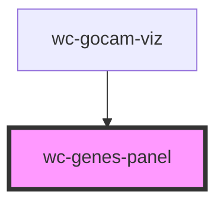

# wc-genes-panel

<!-- Auto Generated Below -->

## Properties

| Property   | Attribute   | Description                                                           | Type  | Default     |
| ---------- | ----------- | --------------------------------------------------------------------- | ----- | ----------- |
| `cam`      | --          | BBOP Graph Handler -> GO-CAM Must be provided to build the side panel | `Cam` | `undefined` |
| `parentCy` | `parent-cy` | Passed by the parent to highlight & clear highlight nodes             | `any` | `undefined` |

## Events

| Event           | Description | Type               |
| --------------- | ----------- | ------------------ |
| `selectChanged` |             | `CustomEvent<any>` |

## Methods

### `highlightActivity(nodeId: any) => Promise<void>`

#### Parameters

| Name     | Type  | Description |
| -------- | ----- | ----------- |
| `nodeId` | `any` |             |

#### Returns

Type: `Promise<void>`

## Shadow Parts

| Part               | Description               |
| ------------------ | ------------------------- |
| `"activity"`       | Activity containers       |
| `"function-label"` | Molecular function labels |
| `"gene-product"`   | Gene product labels       |
| `"process"`        | Process containers        |
| `"process-label"`  | Process label             |

## CSS Custom Properties

| Name                                 | Description                                                         |
| ------------------------------------ | ------------------------------------------------------------------- |
| `--activity-background`              | Background of activity containers                                   |
| `--activity-background-active`       | Background of activity containers when highlighted                  |
| `--activity-border-color`            | Border color of activity containers                                 |
| `--activity-border-width`            | Border width of activity containers                                 |
| `--activity-color`                   | Text color of activity containers                                   |
| `--activity-color-active`            | Text color of activity containers when highlighted                  |
| `--activity-color-active-link-hover` | Hover anchor link color within activity containers when highlighted |
| `--activity-padding`                 | Padding of activity containers                                      |
| `--function-label-background`        | Background of molecular function term labels                        |
| `--function-label-border-color`      | Border color of molecular function term labels                      |
| `--function-label-border-width`      | Border width of molecular function term labels                      |
| `--function-label-color`             | Text color of molecular function term labels                        |
| `--function-label-padding`           | Padding of molecular function term labels                           |
| `--function-nodes-padding`           | Padding of related nodes container                                  |
| `--gene-product-background`          | Background of gene product labels                                   |
| `--gene-product-border-color`        | Border color of gene product labels                                 |
| `--gene-product-border-width`        | Border width of gene product labels                                 |
| `--gene-product-color`               | Text color of gene product labels                                   |
| `--gene-product-padding`             | Padding of gene product labels                                      |
| `--height`                           | Height of the panel                                                 |
| `--node-align-items`                 | Align-items of related node info                                    |
| `--node-background`                  | Background of related node info                                     |
| `--node-border-color`                | Border color of related node info                                   |
| `--node-border-width`                | Border width of related node info                                   |
| `--node-color`                       | Text color of related node info                                     |
| `--node-padding`                     | Padding of related node info                                        |
| `--process-background`               | Background of process containers                                    |
| `--process-border-color`             | Border color of process containers                                  |
| `--process-border-width`             | Border width of process containers                                  |
| `--process-color`                    | Text color of process containers                                    |
| `--process-label-background`         | Background of process labels                                        |
| `--process-label-border-color`       | Border color of process labels                                      |
| `--process-label-border-width`       | Border width of process labels                                      |
| `--process-label-color`              | Text color of process labels                                        |
| `--process-label-padding`            | Padding of process labels                                           |
| `--process-padding`                  | Padding of process containers                                       |

## Dependencies

### Used by

 - [wc-gocam-viz](../gocam-viz)

### Graph

----------------------------------------------

*Built with [StencilJS](https://stenciljs.com/)*
