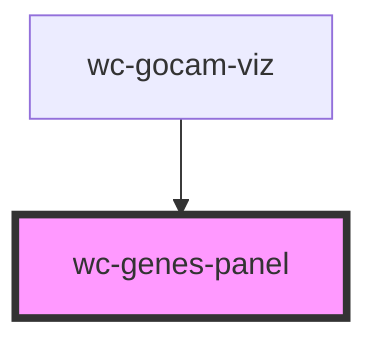

# wc-genes-panel

<!-- Auto Generated Below -->

## Properties

| Property   | Attribute | Description | Type           | Default     |
| ---------- | --------- | ----------- | -------------- | ----------- |
| `ghandler` | --        |             | `GraphHandler` | `undefined` |

## Events

| Event           | Description | Type               |
| --------------- | ----------- | ------------------ |
| `selectChanged` |             | `CustomEvent<any>` |

## Dependencies

### Used by

 - [wc-gocam-viz](../gocam-viz)

### Graph

----------------------------------------------

*Built with [StencilJS](https://stenciljs.com/)*
