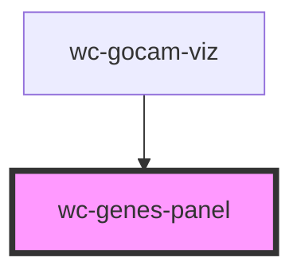

# wc-genes-panel

<!-- Auto Generated Below -->

## Properties

| Property   | Attribute   | Description                                                           | Type           | Default     |
| ---------- | ----------- | --------------------------------------------------------------------- | -------------- | ----------- |
| `ghandler` | --          | BBOP Graph Handler -> GO-CAM Must be provided to build the side panel | `GraphHandler` | `undefined` |
| `parentCy` | `parent-cy` | Passed by the parent to highlight & clear highlight nodes             | `any`          | `undefined` |

## Events

| Event           | Description | Type               |
| --------------- | ----------- | ------------------ |
| `selectChanged` |             | `CustomEvent<any>` |

## Methods

### `scrollToActivity(nodeId: any) => Promise<void>`

#### Returns

Type: `Promise<void>`

## Dependencies

### Used by

 - [wc-gocam-viz](../gocam-viz)

### Graph

----------------------------------------------

*Built with [StencilJS](https://stenciljs.com/)*
