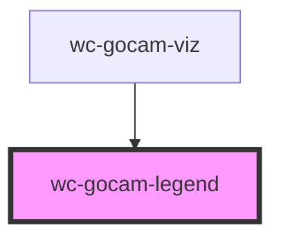

# wc-gocam-legend

<!-- Auto Generated Below -->

## Shadow Parts

| Part         | Description                |
| ------------ | -------------------------- |
| `"header"`   | The header                 |
| `"section"`  | An individual legend entry |
| `"sections"` | Group of legend entries    |

## CSS Custom Properties

| Name                    | Description                    |
| ----------------------- | ------------------------------ |
| `--border-color`        | Border color of the legend     |
| `--border-width`        | Border width of the legend     |
| `--header-background`   | Background of the header       |
| `--header-border-color` | Border color of the header     |
| `--header-border-width` | Border width of the header     |
| `--header-color`        | Text color of the header       |
| `--header-font-weight`  | Text font weight of the header |
| `--header-padding`      | Padding of the header          |
| `--padding`             | Padding of the legend          |

## Dependencies

### Used by

 - [wc-gocam-viz](../gocam-viz)

### Graph

----------------------------------------------

*Built with [StencilJS](https://stenciljs.com/)*
