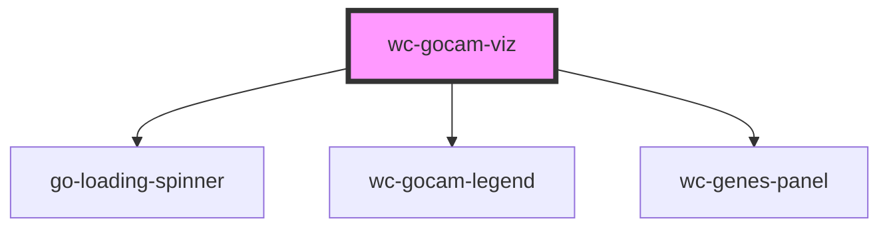

# wc-gocam-viz

<!-- Auto Generated Below -->

## Properties

| Property     | Attribute     | Description                                                                                                                                                               | Type      | Default     |
| ------------ | ------------- | ------------------------------------------------------------------------------------------------------------------------------------------------------------------------- | --------- | ----------- |
| `gocamId`    | `gocam-id`    | ID of the gocam to be shown in this widget. Look for the watcher below that will load the GO-CAM upon a change of this variable                                           | `string`  | `undefined` |
| `repository` | `repository`  | Used to connect to a barista instance. By default, always access production (prod) server prod = http://barista.berkeleybop.org dev  = http://barista-dev.berkeleybop.org | `string`  | `'release'` |
| `showLegend` | `show-legend` | Show/hide default legend                                                                                                                                                  | `boolean` | `true`      |

## Events

| Event          | Description | Type               |
| -------------- | ----------- | ------------------ |
| `layoutChange` |             | `CustomEvent<any>` |
| `nodeClick`    |             | `CustomEvent<any>` |
| `nodeOut`      |             | `CustomEvent<any>` |
| `nodeOver`     |             | `CustomEvent<any>` |

## Methods

### `resetView() => Promise<void>`

Center the cytoscape graph to fit the whole graph

#### Returns

Type: `Promise<void>`

### `setAutoFocus(shouldAF: any) => Promise<void>`

Define if the GO-CAM viz should capture the mouse scroll

#### Returns

Type: `Promise<void>`

### `toggleComplex() => Promise<void>`

#### Returns

Type: `Promise<void>`

## Shadow Parts

| Part                 | Description |
| -------------------- | ----------- |
| `"activities-panel"` |             |
| `"gocam-graph"`      |             |
| `"gocam-panel"`      |             |

## Dependencies

### Depends on

- [go-loading-spinner](../loading-spinner)
- [wc-gocam-legend](../gocam-legend)
- [wc-genes-panel](../genes-panel)

### Graph

----------------------------------------------

*Built with [StencilJS](https://stenciljs.com/)*
