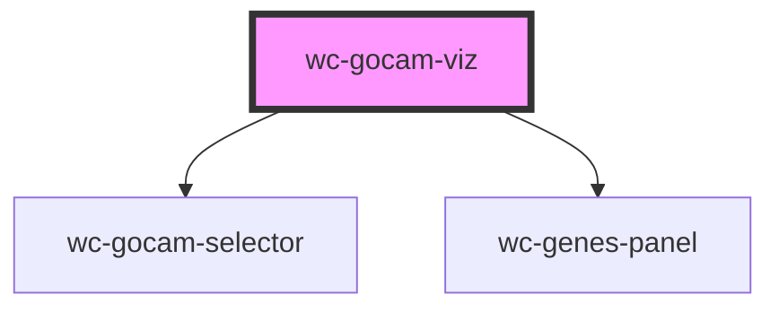

# wc-gocam-viz

<!-- Auto Generated Below -->

## Properties

| Property               | Attribute                | Description                                                                                                                                                               | Type      | Default     |
| ---------------------- | ------------------------ | ------------------------------------------------------------------------------------------------------------------------------------------------------------------------- | --------- | ----------- |
| `autoHideModal`        | `auto-hide-modal`        | Deprecated for the moment                                                                                                                                                 | `boolean` | `false`     |
| `gocamId`              | `gocam-id`               | ID of the gocam to be shown in this widget. Look for the watcher below that will load the GO-CAM upon a change of this variable                                           | `string`  | `undefined` |
| `graphFold`            | `graph-fold`             |                                                                                                                                                                           | `string`  | `"editor"`  |
| `repository`           | `repository`             | Used to connect to a barista instance. By default, always access production (prod) server prod = http://barista.berkeleybop.org dev  = http://barista-dev.berkeleybop.org | `string`  | `'release'` |
| `showActivity`         | `show-activity`          | Show/hide the activity in the activity node                                                                                                                               | `boolean` | `false`     |
| `showGeneProduct`      | `show-gene-product`      | Show/hide the gene product in the activity node                                                                                                                           | `boolean` | `false`     |
| `showGoCamSelector`    | `show-go-cam-selector`   | If true, this will show the list of available GO-CAM in GO For more information, please refer to http://geneontology.org/docs/gocam-overview/                             | `boolean` | `false`     |
| `showHasInput`         | `show-has-input`         | Show/hide the input of an activity                                                                                                                                        | `boolean` | `false`     |
| `showHasOutput`        | `show-has-output`        | Show/hide the output of an activity                                                                                                                                       | `boolean` | `false`     |
| `showIsolatedActivity` | `show-isolated-activity` | Show/hide isolated activity (not connected through causals)                                                                                                               | `boolean` | `false`     |
| `showLegend`           | `show-legend`            | Show/hide default legend                                                                                                                                                  | `boolean` | `true`      |

## Events

| Event          | Description | Type               |
| -------------- | ----------- | ------------------ |
| `layoutChange` |             | `CustomEvent<any>` |
| `nodeClick`    |             | `CustomEvent<any>` |
| `nodeOut`      |             | `CustomEvent<any>` |
| `nodeOver`     |             | `CustomEvent<any>` |

## Methods

### `resetView() => Promise<void>`

Center the cytoscape graph to fit the whole graph

#### Returns

Type: `Promise<void>`

### `setAutoFocus(shouldAF: any) => Promise<void>`

Define if the GO-CAM viz should capture the mouse scroll

#### Returns

Type: `Promise<void>`

## Dependencies

### Depends on

- [wc-gocam-selector](../gocam-selector)
- [wc-genes-panel](../genes-panel)

### Graph

----------------------------------------------

*Built with [StencilJS](https://stenciljs.com/)*
