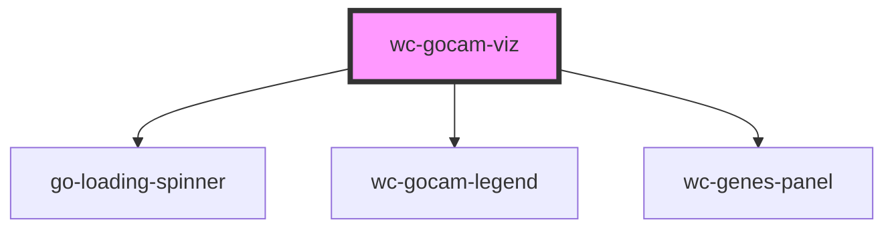

# wc-gocam-viz

<!-- Auto Generated Below -->

## Properties

| Property     | Attribute     | Description                                                                                                                                                               | Type      | Default     |
| ------------ | ------------- | ------------------------------------------------------------------------------------------------------------------------------------------------------------------------- | --------- | ----------- |
| `gocamId`    | `gocam-id`    | ID of the gocam to be shown in this widget. Look for the watcher below that will load the GO-CAM upon a change of this variable                                           | `string`  | `undefined` |
| `repository` | `repository`  | Used to connect to a barista instance. By default, always access production (prod) server prod = http://barista.berkeleybop.org dev  = http://barista-dev.berkeleybop.org | `string`  | `'release'` |
| `showLegend` | `show-legend` | Show/hide default legend                                                                                                                                                  | `boolean` | `true`      |

## Events

| Event          | Description | Type               |
| -------------- | ----------- | ------------------ |
| `layoutChange` |             | `CustomEvent<any>` |
| `nodeClick`    |             | `CustomEvent<any>` |
| `nodeOut`      |             | `CustomEvent<any>` |
| `nodeOver`     |             | `CustomEvent<any>` |

## Methods

### `resetView() => Promise<void>`

Center the cytoscape graph to fit the whole graph

#### Returns

Type: `Promise<void>`

### `setAutoFocus(shouldAF: any) => Promise<void>`

Define if the GO-CAM viz should capture the mouse scroll

#### Returns

Type: `Promise<void>`

### `toggleComplex() => Promise<void>`

#### Returns

Type: `Promise<void>`

## Shadow Parts

| Part                 | Description                                          |
| -------------------- | ---------------------------------------------------- |
| `"activities-panel"` | The panel containing the process and activities list |
| `"activity"`         | An activity in the process and activities list       |
| `"function-label"`   | A function term name in process and activities list  |
| `"gene-product"`     | A gene product name in process and activities list   |
| `"gocam-graph"`      | The GO-CAM graph container                           |
| `"gocam-panel"`      | The panel containing the GO-CAM graph and legend     |
| `"gocam-title"`      | The GO-CAM title                                     |
| `"legend-header"`    | The header of the legend                             |
| `"legend-section"`   | A group of entries in the legend                     |
| `"process"`          | A process group in the process and activities list   |

## CSS Custom Properties

| Name                            | Description                                                                          |
| ------------------------------- | ------------------------------------------------------------------------------------ |
| `--activity-background`         | Background of activity containers in processes and activities panel                  |
| `--activity-background-active`  | Background of activity containers in processes and activities panel when highlighted |
| `--activity-border-color`       | Border color of activity containers in processes and activities panel                |
| `--activity-border-width`       | Border width of activity containers in processes and activities panel                |
| `--activity-color`              | Text color of activity containers in processes and activities panel                  |
| `--activity-color-active`       | Text color of activity containers in processes and activities panel when highlighted |
| `--activity-padding`            | Padding of activity containers in processes and activities panel                     |
| `--border-color`                | Default color of various borders used in the widget                                  |
| `--button-background`           | Background of buttons in widget                                                      |
| `--button-background-hover`     | Background of buttons in widget on hover                                             |
| `--button-border-color`         | Border color of buttons in widget                                                    |
| `--button-border-radius`        | Border radius of buttons in widget                                                   |
| `--button-border-width`         | Border width of buttons in widget                                                    |
| `--button-color`                | Text color of button text in widget                                                  |
| `--function-label-background`   | Background of molecular function term labels in processes and activities panel       |
| `--function-label-border-color` | Border color of molecular function term labels in processes and activities panel     |
| `--function-label-border-width` | Border width of molecular function term labels in processes and activities panel     |
| `--function-label-color`        | Text color of molecular function term labels in processes and activities panel       |
| `--function-label-padding`      | Padding of molecular function term labels in processes and activities panel          |
| `--function-nodes-padding`      | Padding of related nodes container in processes and activities panel                 |
| `--gene-product-background`     | Background of gene product labels in processes and activities panel                  |
| `--gene-product-border-color`   | Border color of gene product labels in processes and activities panel                |
| `--gene-product-border-width`   | Border width of gene product labels in processes and activities panel                |
| `--gene-product-color`          | Text color of gene product labels in processes and activities panel                  |
| `--gene-product-padding`        | Padding of gene product labels in processes and activities panel                     |
| `--graph-height`                | Height of GO-CAM graph container                                                     |
| `--graph-padding`               | Padding of GO-CAM graph container                                                    |
| `--legend-border-color`         | Border color of legend container                                                     |
| `--legend-border-width`         | Border width of legend container                                                     |
| `--legend-header-background`    | Background of legend header                                                          |
| `--legend-header-border-color`  | Border color of legend header                                                        |
| `--legend-header-border-width`  | Border width of legend header                                                        |
| `--legend-header-color`         | Text color of legend header                                                          |
| `--legend-header-padding`       | Padding of legend header                                                             |
| `--legend-padding`              | Padding of legend container                                                          |
| `--node-background`             | Background of related node info in processes and activities panel                    |
| `--node-border-color`           | Border color of related node info in processes and activities panel                  |
| `--node-border-width`           | Border width of related node info in processes and activities panel                  |
| `--node-color`                  | Text color of related node info in processes and activities panel                    |
| `--node-padding`                | Padding of related node info in processes and activities panel                       |
| `--panel-border-color`          | Border color of the main panels of the widget                                        |
| `--panel-border-width`          | Border width of the main panels of the widget                                        |
| `--panel-header-background`     | Background of main panel headers                                                     |
| `--panel-header-border-color`   | Border color of main panel headers                                                   |
| `--panel-header-border-width`   | Border width of main panel headers                                                   |
| `--panel-header-color`          | Text color of main panel headers                                                     |
| `--panel-header-font-weight`    | Text font weight of main panel headers                                               |
| `--panel-header-padding`        | Padding of main panel headers                                                        |
| `--process-background`          | Background of process containers in processes and activities panel                   |
| `--process-border-color`        | Border color of process containers in processes and activities panel                 |
| `--process-border-width`        | Border width of process containers in processes and activities panel                 |
| `--process-color`               | Text color of process containers in processes and activities panel                   |
| `--process-label-background`    | Background of process labels in processes and activities panel                       |
| `--process-label-border-color`  | Border color of process labels in processes and activities panel                     |
| `--process-label-border-width`  | Border width of process labels in processes and activities panel                     |
| `--process-label-color`         | Text color of process labels in processes and activities panel                       |
| `--process-label-padding`       | Padding of process labels in processes and activities panel                          |
| `--process-padding`             | Padding of process containers in processes and activities panel                      |

## Dependencies

### Depends on

- [go-loading-spinner](../loading-spinner)
- [wc-gocam-legend](../gocam-legend)
- [wc-genes-panel](../genes-panel)

### Graph

----------------------------------------------

*Built with [StencilJS](https://stenciljs.com/)*
