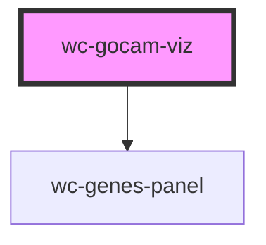

# wc-gocam-viz

<!-- Auto Generated Below -->

## Properties

| Property          | Attribute           | Description | Type      | Default     |
| ----------------- | ------------------- | ----------- | --------- | ----------- |
| `autoHideModal`   | `auto-hide-modal`   |             | `boolean` | `false`     |
| `gocamId`         | `gocam-id`          |             | `string`  | `undefined` |
| `graphFold`       | `graph-fold`        |             | `string`  | `"editor"`  |
| `showActivity`    | `show-activity`     |             | `boolean` | `false`     |
| `showGeneProduct` | `show-gene-product` |             | `boolean` | `false`     |
| `showHasInput`    | `show-has-input`    |             | `boolean` | `false`     |
| `showHasOutput`   | `show-has-output`   |             | `boolean` | `false`     |

## Events

| Event          | Description | Type               |
| -------------- | ----------- | ------------------ |
| `layoutChange` |             | `CustomEvent<any>` |
| `nodeClick`    |             | `CustomEvent<any>` |
| `nodeOut`      |             | `CustomEvent<any>` |
| `nodeOver`     |             | `CustomEvent<any>` |

## Methods

### `resetView() => Promise<void>`

#### Returns

Type: `Promise<void>`

## Dependencies

### Depends on

- [wc-genes-panel](../genes-panel)

### Graph

----------------------------------------------

*Built with [StencilJS](https://stenciljs.com/)*
